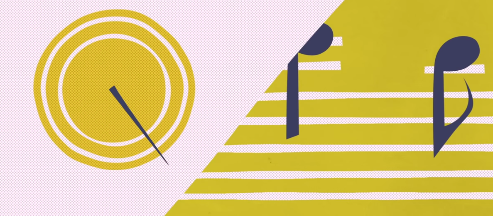

## Polyrhythm

There are already sundry polyrhythm visualization and practice utilities on the web. 
These are just my take on the same – a sandbox within which to have some fun with web
front-end tech. This will involve JS & SVG single page apps (SPAs) – maybe even get
into using the microphone?

### Motivation
The following are some examples of what exists and how I would like to improve upon the ideas.

The book [Clave Matrix](http://www.unlockingclave.com/volume-1-the-clave-matrix.html) 
is actually the original motivator for this project.
The book's website has [a visualization of the standard bell pattern](http://www.unlockingclave.com/standard-pattern-animation.html)
which is simply a Quicktime video. That is just begging to be a SVG-based SPA.

The book has other visualizations and animations that would be fun to web-ify. 
Even the cover image is a 2:3 polyrhythm representation. Probably the best thing
to bang out would be an interactive way of exploring the 3 part polyrhythm that is
the clave. There could be options to do the son clave or the rumba clave, etc.

[Polyrhythm - 3 against 4 & 4 against 3](https://www.youtube.com/watch?v=AgdLLitVxfI) 
is good enough. But notice how the video suggest to modify the playback speed to make
play along harder or easier. 

#### Prior art
This is a list of interesting visualizations and/or tools for polyrhythm. The minimum requirement for
membership on this list is that there be audio and the the intent is more instructional rather than simply a nice performance.

##### Interactive

##### Noninteractive
- [The Clave Matrix part 1 (audio tracks that go with the book)](http://ge.tt/5orZ2Ba)
- [Michael Spiro: Bata Rhythms with the LP Hi-Hat Shekere](https://www.youtube.com/watch?v=8VttJ5rTwcM)

#### Further reading
These are polyrhythm resource which do not include audio, but go into the deeper theory.
The whole goal of this project is to come up with tools which help folks grok the deeper theory
without having to know how to read music or understand much music theory. The only thing in-scope
is the dissemination of polyrhythmic theory.

- David Peñalosa
  - Author of The Clave Matrix book(s)
  - https://en.wikipedia.org/wiki/Clave_(rhythm)
    - Peñalosa contributes to that page as [Dr clave](https://en.wikipedia.org/wiki/User:Dr_clave)
- Godfried Toussaint
  - a Research Professor of Computer Science
  - https://en.wikipedia.org/wiki/Clave_(rhythm)#Mathematical_Analysis
  - [The Geometry of Musical Rhythm: What Makes a "Good" Rhythm Good?](http://www.crcpress.com/product/isbn/9781466512023)
- Bob Hinz
  - [An Easy Method for Understanding and Playing Polyrhythms](http://www.bobhinz.com/PDFs%20of%20Published%20&%20Unpublished%20Articles/An%20Easy%20Method%20For%20Understanding%20and%20Playing%20Polyrhythms.pdf)
  - [Working With Cross Rhythms](http://www.bobhinz.com/PDFs%20of%20Published%20&%20Unpublished%20Articles/Working%20With%20Cross%20Rhythms.pdf)
- [Why is son clave so awesome?](http://www.ethanhein.com/wp/2013/why-is-son-clave-so-awesome/)
